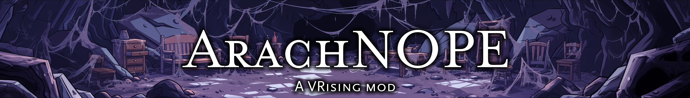

# ArachNOPE



Replaces all spider visuals in V Rising with furniture models to help players with arachnophobia enjoy the game.

**WARNING: Biting spiders is broken with this mod installed.** The spider model is hidden by scaling its model to zero, which scales the bite interaction radius to zero, making it impossible to bite the creature. This includes Ungora the Spider Queen (V-Blood). Players will need to use other mods or get a friend to kill Ungora to receive unlock credit.

## Features

 - **Spider enemies replaced** - All NPC spider types (Spiderlings, Broodmothers, Ungora the Spider Queen, summoned ability spiders, etc.) are visually replaced with furniture when they spawn. Combat mechanics and hitboxes are unchanged.
- **Spider shapeshift replaced** - The vampire spider shapeshift buff replaces your spider model with furniture. The furniture follows your character and disappears when the buff ends.
 - **Client-side only** - Installed on your client, does not affect other players or require server-side installation.

## Manual Installation

1. Install [BepInExPack V Rising](https://thunderstore.io/c/v-rising/p/BepInEx/BepInExPack_V_Rising/) to your V Rising client folder
2. Place `ArachNOPE.dll` in `VRising/BepInEx/plugins/`
3. Start the game. Spiders are replaced with furniture

## Spiders Replaced

- Spider (Melee, Ranged, Forest variants and their summons)
- Spiderling, Spiderling (Vermin Nest)
- Baneling, Baneling (Summon)
- Broodmother
- Ungora the Spider Queen (and Gate Boss variant)
- Unstable Arachnid, Unstable Arachnid (Small)
- Vampire spider shapeshift buff (player spider form)

Each spider type is replaced with a different furniture model (chair, stool, table, throne, etc.).

## Known Limitations

- Spiders appear to slide instead of walk
- All ability effects are unchanged and untouched. We only target the models

## Building from Source

```bash
dotnet build -c Release
```

The built DLL is at `bin/Release/net6.0/ArachNOPE.dll`.